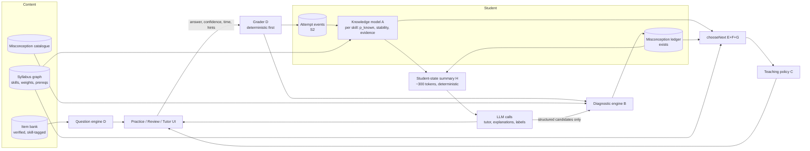

# Learnora learning engine: proposed architecture

**Status: proposal. Nothing here is implemented** unless marked *(exists)*. Grounded in [current-state-audit.md](current-state-audit.md), [deep-dives.md](deep-dives.md) and [learning-science.md](learning-science.md).

**Design stance:** evolve, do not rewrite. Most of the parts exist as pure, tested modules: `trajectory`, `mastery`, `misconceptions`, `mistakeLoop`, `tutorPolicy`, `srs`, `syllabus`. What is missing is (1) a **shared identity for skills**, (2) **one evidence stream** that every tool writes to, and (3) **one decision function** in place of six.

---

## 0. The three structural changes everything else depends on

| # | Change | Replaces | Why first |
|---|---|---|---|
| S1 | **Canonical skill ID** = syllabus topic ID (`lib/syllabus`). Decks, quiz items, ledger rows and events carry `skill_id`. Free-text topics map to a skill once, at write time (deterministic match, then an AI suggestion the student confirms), never again at read time. | `topicMatches` subset-word joins [R7] | Every model downstream currently inherits false joins. |
| S2 | **One attempt-event stream**: extend `learning_events` *(exists)* with `item_id`, `skill_id`, `correct`, `confidence`, `response_ms`, `hint_rung`, `item_verified`, `distractor_misconception_id`, `attempt_no`. | Evidence spread across `quiz_attempts.answers_json`, `learning_events`, card fields and ledger observations | One fold, one truth, and analysable later. |
| S3 | **One `chooseNext(state, minutes)`** pure function that the Today screen, Plan and the tutor all call. | `getAdaptiveRecommendations`, `nextStep`, `studyNow`, `todayPlan`, `specPriorities`, trajectory interventions, `getPreExamSurgeQueue` | Removes contradictory advice. Existing modules become its *inputs*, not competitors. |

---

## 1. Data flow

**Rule:** AI never writes to the knowledge model directly. It proposes candidates (labels, item drafts, explanation grades), and deterministic code decides what counts as evidence.

---

## A. Student knowledge model

- **Purpose.** Per student and skill: how likely they know it now, how sure we are, and how fast it fades.
- **Inputs.** Attempt events (S2), FSRS state of cards tagged to the skill *(exists)*, prerequisite edges *(exists in syllabus)*.
- **Outputs.** For each skill: `p_known`, `evidence_n` (distinct items on distinct days), `stability_days`, `last_seen`, `highest_item_type_passed` (recall, apply, explain), and `status ∈ {unmeasured, learning, fragile, secure, fading}`.
- **Decision rules.**
  1. **Guess-adjusted Bayesian update (BKT-style [L14])**. Start with fixed parameters: guess = 1/n options for MCQ (0.05 for numeric), slip = 0.1, learn = 0.15. *Do not fit parameters* until there are thousands of attempts.
  2. **Repeat exposures discount.** A second correct answer on the *same* item counts at most 0.25 of a new item. Hint-assisted correct counts 0 *(exists, for the ledger)*. Reaching the worked solution counts as incorrect *(exists)*.
  3. **Slow-correct counts less.** If `response_ms` exceeds the item's median ×2, apply the update with half weight (borrowed from Math Academy [C5]).
  4. **Forgetting** uses one curve, FSRS retrievability, for both scheduling and forecasting. Delete the `exp(-t/S)` duplicate [R3].
  5. **Status labels need evidence, not just a threshold.**
     - `secure` needs p_known ≥ 0.85, at least 3 correct on at least 2 distinct items across at least 2 days, and one application-type item.
     - `fragile` means p_known is high but the evidence rule is unmet.
     - `fading` means projected retrievability < 0.7 within 7 days.
     - The mastery ladder's rungs map to `highest_item_type_passed`, so "Applied" means an application item was passed.
  6. **Stale or insufficient evidence.** If `evidence_n` < 2 or nothing in 45 days, the status is `unmeasured` and the UI says so *(the honesty principle already exists)*.
- **Data.** Events, item metadata (type, options, verified, median time), syllabus graph.
- **AI vs deterministic.** 100% deterministic.
- **Failure modes.** Mis-tagged items (wrong skill), mitigated by S1 and item review. Parameter misfit, mitigated by calibration monitoring (I). Gaming by repetition, mitigated by rule 2.
- **Evaluation.** Calibration: predicted p_known vs next-attempt correctness on *new* items (Brier score, reliability plot). Run monthly once the volume allows.
- **Integration.** Replaces the score-event fold in `trajectory.applyEvents` and the thresholds in `mastery.rungFor`. The `TopicState` shape survives, with `mastery` mapped to `p_known` × retrievability.

## B. Diagnostic engine

- **Purpose.** Find gaps quickly at the start, and classify each wrong answer conservatively.
- **Inputs.** Syllabus graph, verified items, answer events, catalogue *(exists)*.
- **Outputs.** Placement knowledge state; per-answer classification; ledger candidates *(ledger exists)*.
- **Decision rules.**
  1. **Placement check.** At most 12 items per subject (ALEKS caps at 25 [C12]). Choose the item whose skill splits the remaining uncertainty best on the prerequisite graph. Each answer updates the skill and its prerequisites or dependents with *discounted* credit [C5]. Offer an "I haven't learned this yet" option [C16, C36]. Give **no feedback** during placement [C36].
  2. **Per-answer classification table** (applied in order):

     | Signal | Classification | Action |
     |---|---|---|
     | Wrong + mapped distractor + confident | **Misconception (strong)** | Ledger evidence; repair now |
     | Wrong + mapped distractor + unsure | Misconception (weak) | Ledger evidence flagged provisional; practice item |
     | Wrong + catalogue cue match *(exists)* | Misconception (as today) | Repair |
     | Wrong + skill `secure` + fast + unmapped distractor | **Possible slip** | No ledger write; re-ask a sibling item later in the session; if that is also wrong, reclassify as a gap |
     | Wrong + 2nd failure on the skill this session | **Possible prerequisite gap** | Probe the weakest prerequisite with one item |
     | Wrong otherwise | Gap | Teaching policy C |
     | Correct + unsure | Fragile | One more item, no rung change |
     | Correct + open misconception on this skill | Probe | Ask "why is the other option wrong?" (one line) [C4, L13] |

  3. **No diagnosis from one weak signal.** AI-labelled misconceptions stay `provisional` until seen twice *(exists: `isNamedPattern`)*.
- **AI vs deterministic.** Placement, the table and distractor mapping are deterministic. AI only labels uncatalogued wrong answers *(exists: `mistakeLabel`)* and proposes distractor mappings for new items, which a human reviews.
- **Failure modes.** False "misconception" labels, which are worse than none (the catalogue comment says so). Mitigated by the confidence gate and provisional status. Placement fatigue, mitigated by the 12-item cap and "skip".
- **Evaluation.** Teacher review of a random sample of 50 ledger rows per month for agreement. Placement accuracy as the share of placed-`secure` skills answered correctly on first practice.
- **Integration.** Extends `misconceptions.ts` extractors and `mistakeLoop.ts`. Placement is new; it plugs into onboarding *(exists)*.

## C. Teaching engine (policy)

- **Purpose.** Pick *the kind* of help, not just the topic.
- **Inputs.** Skill status (A), ledger (B), item type, student level (`levelGuidance`, which exists).
- **Outputs.** The next step's mode: worked example → completion problem → independent → mixed review, or repair, or prerequisite probe.
- **Decision rules.**
  - `unmeasured` or `learning` with p < 0.4: worked example first, then a faded/completion item [L5].
  - p 0.4–0.85: independent items, hint ladder on demand *(exists)*.
  - `secure`: interleaved mixed review only [L6].
  - Matched misconception: catalogue repair *(exists)*, contrast example, retest at least 2 days later on a new item *(exists)*.
  - Two failures in a session: stop new content and probe the prerequisite [C5].
  - Answers are never refused; they are reached through the ladder *(exists)* [L8].
- **AI vs deterministic.** Policy is deterministic. AI writes the *words* (explanation, hint) **given the verified solution and the student-state summary**. It never solves an item itself to decide correctness [L8, C15].
- **Failure modes.** Explanation contradicts the key. Mitigated by passing the key and checking the explanation names it *(an eval type exists)*. Over-scaffolding experts, mitigated by policy gating on status.
- **Evaluation.** Time to first independent correct; delayed accuracy by entry mode (A/B within student across skills).
- **Integration.** Generalises `tutorPolicy.ts` and `nextStep.ts`.

## D. Question and assessment engine

- **Purpose.** Serve items whose keys are trustworthy, tagged to skills, at the right difficulty, and grade them deterministically wherever possible.
- **Item schema** (extends `question_bank` *(exists)*): `id, skill_id, board, type (mcq|numeric|expression|short|long), stem, options[], key, tolerance/units, solution_steps, distractor_misconception_ids[], difficulty (est), item_kind (recall|apply|explain), source, licence, verified_by, verified_at, exposure_count, p_correct, median_ms, reports`.
- **Three supply tiers** (choose in order):
  1. **Curated bank**: Learnora-written plus OGL imports *(228 + 1,050 pending)* [R8].
  2. **AI-generated, verified, then promoted**: generate → independent solve check *(exists, not deployed)* → serve labelled "new". Promote to the bank after N ≥ 20 exposures with no upheld reports and a plausible `p_correct` (0.2–0.95). Store, so the same item is never generated twice.
  3. **AI-generated, unverified**: only when verification is unavailable, labelled *(exists)*. **Does not update the knowledge model or ledger.**
- **Grading by type:**

  | Type | Grader | Feeds mastery? |
  |---|---|---|
  | MCQ | Key match *(exists)* | Yes |
  | Numeric | Parse, then compare within tolerance and unit check (deterministic) | Yes |
  | Algebraic expression | Equivalence by evaluating at random points (deterministic, small library or own code) | Yes |
  | Short answer (≤1 sentence) | LLM rubric against a stored mark scheme, structured output `{score, matched_points[], confidence}` | Yes, at half weight, and only when confidence is high |
  | Long or competency answer | LLM rubric, shown as *provisional marks with the scheme points*; student self-check | No (until grader κ ≥ 0.7 against teachers) |

- **Difficulty.** Start from the author or LLM estimate. Replace with empirical `p_correct` after 20 exposures. Target about 75–85% expected success when selecting practice (validate the Math Academy rule [C5] locally).
- **Failure modes.** Wrong keys, as the production audit already found [R6 header]. Mitigated by tiering and reports *(exist)*. Item memorisation, mitigated by exposure tracking and A-rule 2.
- **Evaluation.** Key error rate (reports upheld ÷ exposures); grader agreement (κ) on a 200-answer human-marked set per type.
- **Integration.** `quizQuality.js`, `questionVetting.ts`, `questionReports`, `question_bank` *(all exist)*.

## E. Mastery and adaptation engine (`chooseNext`)

- **Purpose.** One answer to "what now?", for a given number of minutes.
- **Inputs.** A, B (ledger), F (due items), G (exam weights and date), minutes available.
- **Algorithm (deterministic, explainable).**
  1. **Hard queue** (time-capped at 40% of minutes): misconception retests due; due reviews with retrievability < 0.85.
  2. **Value queue.** Score every skill by `exam_weight × (1 − p_known × R_examday) × prereq_ready × freshness_penalty`. Pick the top skill. The activity mode comes from C.
  3. **Prerequisite override**: if the top skill's prerequisite has p < 0.5, serve the prerequisite.
  4. Return 1–3 cards with a one-sentence *reason* each ("Due: you fixed this belief 2 days ago; time to check it stuck").
- **Conflicting evidence.** The most recent new-item evidence wins within a session. Across sessions, use the Bayesian update; neither "latest" nor "average" alone.
- **Guessing.** Handled by guess-adjusted updates (A1) and confidence (B).
- **Repeated attempts and memorisation.** A same-item repeat is discounted (A2). Mastery needs distinct items on distinct days (A5).
- **Integration.** `todayPlan.ts` keeps its scenario framing (short, returning, rough, next) but delegates `next` to `chooseNext`. `trajectory` keeps the *forecast* and supplies `R_examday`.

## F. Retention and revision engine

- **Purpose.** Schedule review of cards, items and skills; detect forgetting.
- **Recommendation: the simple option first.**
  1. Cards: FSRS *(exists)*. Upgrade the parameters to the current FSRS release [C33]. Per-user fitting only after a user has at least 1,000 reviews.
  2. Skills and misconceptions: **fixed expanding intervals** (1, 3, 7, 14, 30 days), reset to 1 on failure, compressed to fit before the exam date [L2]. This is deliberately not FSRS: there is not enough data, and the gains of fancier models are unproven at this scale.
  3. Forgetting detection: a scheduled review answered wrong on a `secure` skill sets status to `fading` and enters the hard queue.
- **Evaluation.** Calibration of predicted vs observed recall at review time [C33 metrics]. Consider HLR or FSRS-for-skills only if expanding intervals are clearly miscalibrated with real data.
- **Integration.** `srs.ts`, `mistakeLoop` retest (`RESOLVE_AFTER_DAYS` *exists*).

## G. Progress and planning engine

- **Purpose.** Turn evidence into priorities the student believes and can act on.
- **Rules.**
  - Show status with its evidence: "Secure, 4 questions over 3 days". Never a bare percentage. Show ranges, not points, for forecasts *(bands exist)*.
  - Reward *due items completed correctly* and *misconceptions resolved*, not minutes or activity [L11].
  - The plan is `chooseNext` run forward over Life Sync availability *(exists)* with the exam date. No separate planner logic.
  - CBSE: show the two-exam structure (main exam and an optional improvement exam [C40]) as two planning horizons. Unverified against a CBSE circular.
- **Failure modes.** False precision (the drift score shown as a hard number). Mitigated by bands and the evidence count.
- **Evaluation.** Students' predictions of their own exam readiness vs actual (self-report vs past-paper tracker *(exists)*).

## H. Tutor orchestration

- **Purpose.** Every AI surface sees the same compact, true picture of the student, and writes back through one door.
- **Student-state summary (SSS).** Built deterministically, about 300 tokens, cached per student and invalidated on new events: level and board; current skill with status and evidence; top 3 open misconceptions (concept plus one-line belief) *(the formatter exists: `formatMisconceptionsForPrompt`)*; the last 3 attempts on this skill; the hint rung reached; minutes left today. **No raw chat history beyond the last 6 turns.**
- **Contract per call.** `{task, sss, item (with verified key and solution), retrieved_note_passages≤3}` in; structured JSON out (`{reply, hint_rung, claims_answer_correct?: never, ledger_candidates[]}`).
- **Consistency.** The tutor receives the key and solution, so it cannot contradict grading. A post-check verifies the reply does not assert a different answer (extends the leak check, which exists).
- **Consolidation.** Debugger, Feynman, Sparring, Pre-mortem and Exam Detective become **modes of one tutor** using the same SSS and the same ledger writer, not five prompts with their own extraction code. Decide per tool on usage data whether to keep a separate surface.
- **Integration.** `chatPrompt.ts`, `ChatProvider`, `formatMisconceptionsForPrompt`, `learnora-ai` modes *(exist)*.

## I. Evaluation and safety

| Area | Mechanism | Pass bar (initial) |
|---|---|---|
| Key correctness | Independent solve check *(exists)*; upheld reports per 1k exposures | < 2 upheld per 1k |
| Grading accuracy | Human-marked set of 200 per answer type; κ | κ ≥ 0.7 before feeding mastery |
| Tutor pedagogy | `evals/` fixtures *(exist)*: leak, level, names the correct answer; **run in CI on a schedule** with a pinned model | ≥ 95% pass |
| Misconception precision | Monthly teacher review of 50 rows | ≥ 80% agree |
| Curriculum alignment | Every item has `skill_id` and `board`; out-of-syllabus items blocked for board-specific practice | 100% tagged |
| Age-appropriateness and safety | `contentSafety.js` *(exists)*; users 13+; consent at first use *(exists)* | No regressions |
| Privacy | Disclosed-provider allowlist *(exists)*; SSS contains no name or email; no study data to undisclosed providers | Test enforced *(exists)* |
| Hallucination | Tutor is given verified solutions; unverified items never update mastery | Structural |
| **Learning** | Delayed retention on unseen items; error recurrence (see [strategy-roadmap.md](strategy-roadmap.md) §metrics) | Directional first, then powered |

---

## AI vs deterministic responsibility (summary)

| Deterministic (code decides) | AI (proposes; code accepts or rejects) |
|---|---|
| Grading MCQ, numeric, expression | Wording of explanations, hints, repairs (given the key) |
| Knowledge-model updates | Drafting new items (then verified and promoted) |
| Misconception status transitions *(DB trigger exists)* | Labelling uncatalogued wrong answers (provisional) |
| Next activity, scheduling, plan | Proposing distractor→misconception mappings (human review) |
| Placement item selection | Rubric marking of short and long answers (weighted or provisional) |
| What counts as evidence | Mapping a free-text topic to a skill (student confirms) |
